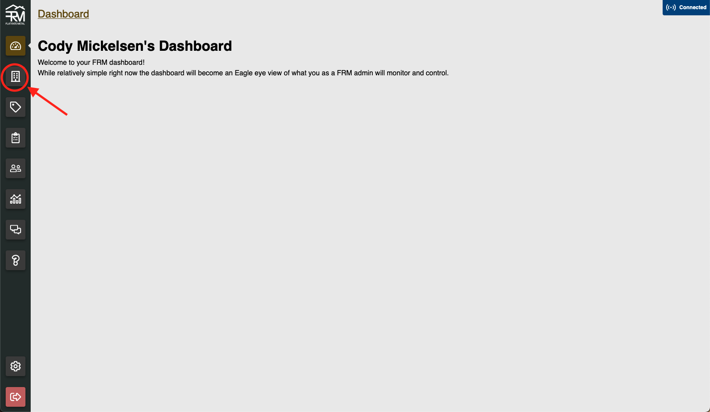

# Company Management

Welcome to the FRM Admin Portal Company Management Docs! All of the processes listed in this documentation begin by selecting the "Companies" tab on the left-hand side of the admin portal home page.

Once the companies tab is selected, you will be redirected to the companies page, which shows a list of all registered companies and their statuses.

## Add Company

A company can be added to the database by clicking the green "Add Company" button at the top of the page.

Fill out the requested information in the form and click the blue "Add" button. To stop the process of creating a company, click "Cancel".

## Edit Company

To Edit a company, select the company you wish to edit from the list. This will bring you to the Company Details Page.

Clicking the blue "Edit" button at the top of the page will bring up a form similar to the create a new company form. Change the information filled in the form, and click "Save & Close"

You can also click on any one of the blue "Add \_\_\_" buttons in each of the sections.

When you click on these buttons, a form will appear that will ask for a tag and whatever information you are needing to enter. The tag can be anything to describe the new information: home phone, personal address, backup email, etc. Then enter the new information.

When you add new information, it will automatically be added to the company details page.

:::note

If you do not see the new information, try refreshing the page

:::

## Review Company

When a company signs up to use the app, they create their account, and then receive a notice that their company is pending review. They will see this persistent notification, as well as only see MSRP pricing until their company is approved, and their pricing tier is set. The admin portal will highlight which companies are pending review in yellow:

To approve this company, click on the name of the company to be taken to the company details page. In this case, we would click on the name "Brando Gutter".

From here, click on the blue "Edit" button in the left-hand corner.

Once the window is open, we can see all of the details about the specific company. We will change "Status" to "Active", and set the "Pricing Tier" to either "Dealer" or "Contractor". Very rarely, if ever, will you leave a company set at MSRP pricing.

Once you have made the changes and approved the company, click the blue "Save & Close" button. This will save the information, and bring you back to the company details screen.

## Delete Company

If a company no longer wishes to use the system and requests to be removed, click on the red "Delete" button in the left-hand corner. To confirm the delete, click on the blue "Proceed" button. The company will then be removed from the system, and you will be returned to the company list page.

## Add Company User

While company admins can add users from the app, sometimes it will need to be done in the admin portal. To do this, click on the green "Add User" button in the left-hand corner. A window will be brought up where you can enter the information for a company user. Enter the information, and a password for the new user. You can also check the box to randomly generate a password for the user, which they can change later. An email will be sent to the new user with their login information.

## Delete Company User

If you wish to delete a company user, go to the users tab of the company details page.

Click the name of the user you wish to delete.

Click the red "Delete" button in the left hand corner.

Confirm the delete.

You will then be redirected back to the users page.
