# User Management

Welcome to the FRM Admin Portal User Management Docs! All of the processes listed in this documentation begin by selecting the "Users" tab on the left-hand side of the admin portal home page.

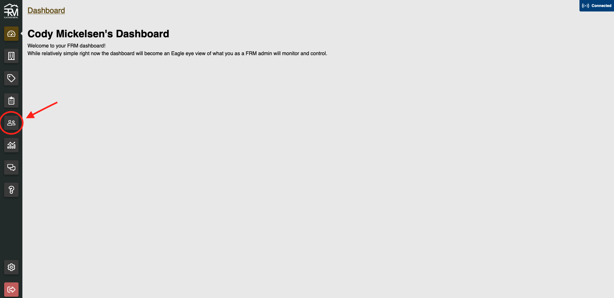

## Add Admin User

To add an admin user to the database:

1. Click on the green "Add Admin User" button above the list of current users. 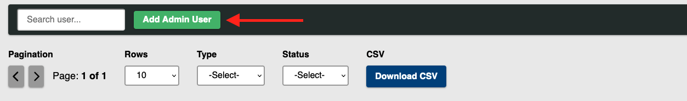
2. Fill out the new user's name, email, and phone number. Fields marked with a star are required for account creation. 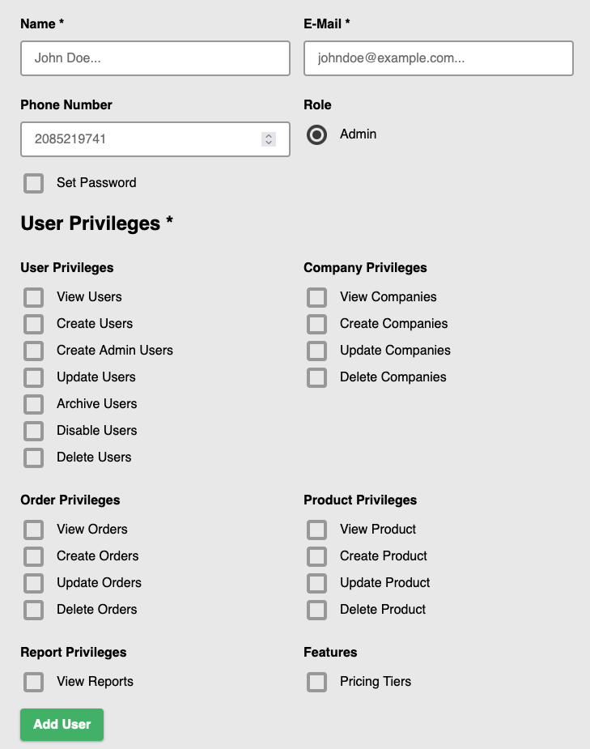
3. Check the box next to the privileges you would like the user to have.
4. Once all required fields have been filled out, click on the green "Add User" button at the bottom of the page. 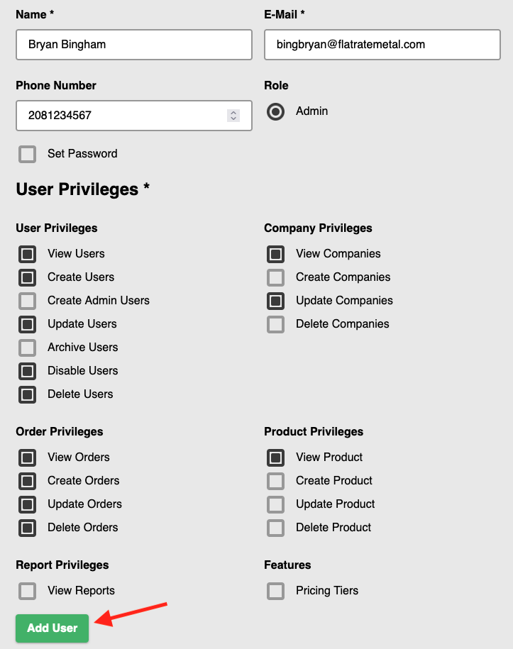

:::tip Just In Case!

After clicking "Add User" you will be directed back to the users list page. If you do not see the user you just created, refresh the page.

:::

## Update User

To update a user, first select the user from the list of current users: 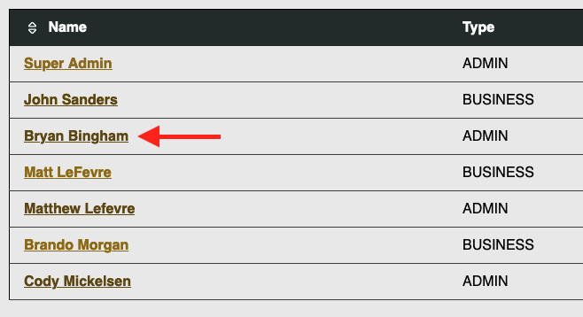

This will bring you to the user details page. From here we can manage the user information.

Select "Edit" from the option buttons at the top of the page. 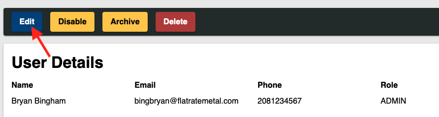

Once the edit user page has been opened, you may edit any of the information about the user. When done, click "Save". To close without changing anything, you can also click "Cancel Without Saving" at the top of the page.

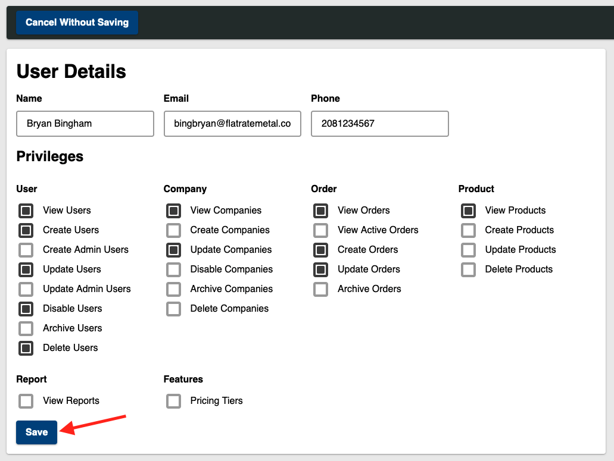

After saving your changes, you should be directed back to the user details page, here you can verify that your changes were saved.

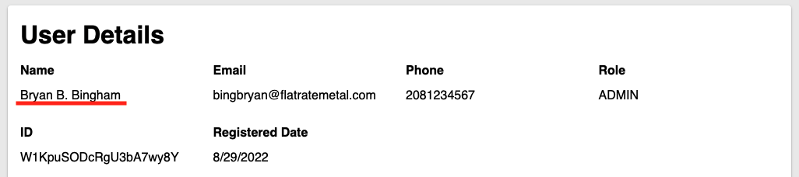

## Change User Password

From the user details page, you can also change a user's password manually.

In order to change a user's password, you first check the box marked "Did the user grant you verbal or written permission to change their password?" This will enable typing in the "New Password" and "Retype New Password" boxes.

After entering and confirming the new password, click the red "Change Password Button"

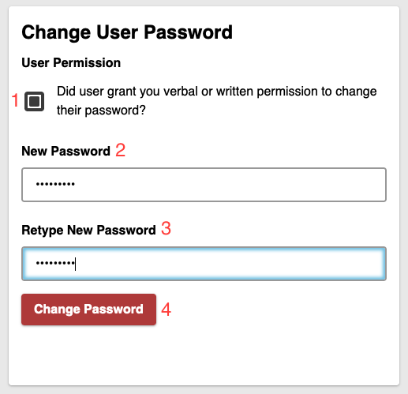

You should see a green notification in the top right corner saying that the reset was successful.

## Disable User

To disable a user and prevent them from logging in, you can click on the yellow "Disable" button at the top of the page.

When prompted, select the red "Disable User" button. This will disable the user from the using the system.

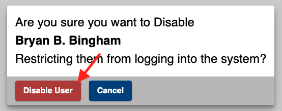

:::tip

If you do not see the status of the user change immediately, refresh the page to see the changes.

:::

To reactivate a disabled user, click the green "Activate" button at the top of the user details page.

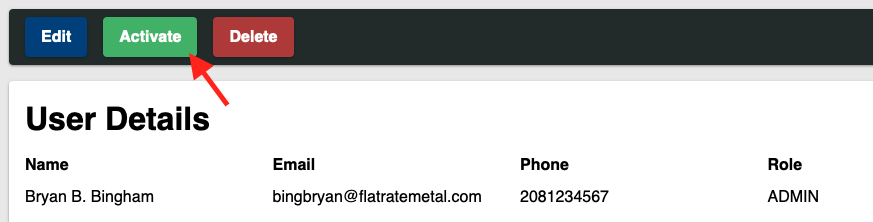

:::note

The "Activate" button will only show up for disabled users

:::

## Delete User

:::danger

Account deletion is PERMANENT. Any user that is deleted will have to be re-entered into the system. There is no recovering a deleted account.

:::

To delete a user, click the red "Delete" button at the top of the user details page.

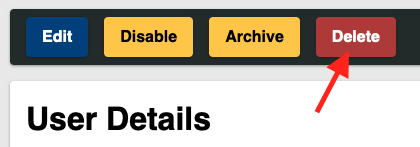

When prompted, click the red "Delete User" button.

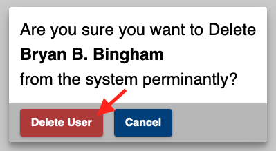

When the delete is completed, you will be redirected to the active users screen. The deleted user will no longer be listed.
