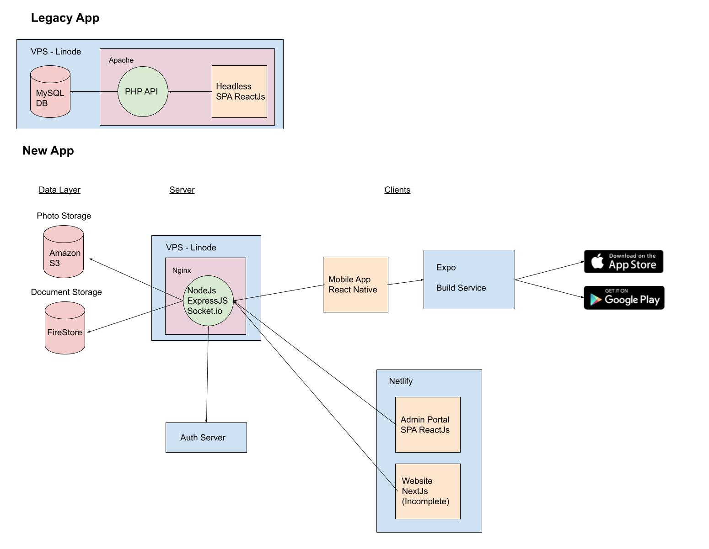
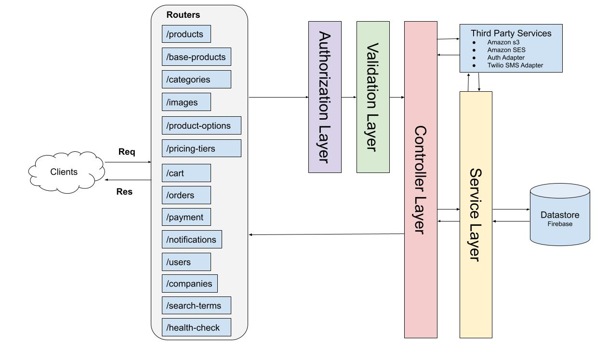

# Getting Started

## Project Architecture

;

## Rest API Diagram

This diagram expresses how data flows through the components of our backend system.



## API Components

### Clients

Clients are entities that make requests to our API, they could be websites, native apps, or HTTP clients like postman (generally they are front-end applications in the case of FRM but they could be other servers). Clients must be authorized to make requests to the API by including their static IP address or URL to our whitelist in server.ts.

```typescript
// ...server.ts

const corsOptions = {
  [
    "https://client-website-address",
    "http://localhost:3000",
    ...
  ]
}
```

Users interact with clients to submit/view/update orders browse products or administer the sytem.

### Routers

Routers are structures that expose endpoint routes or paths. When a client makes a request to the service the router matches the correct endpoint to the request and this flows through all the other complex layers and components of the system.
