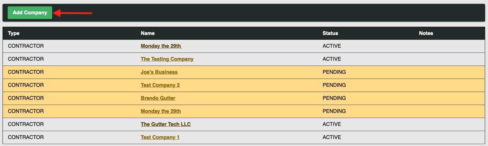
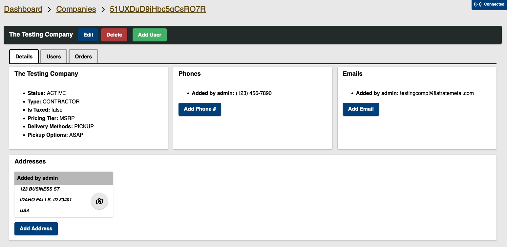
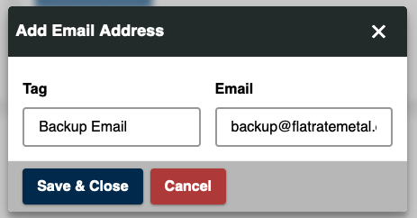
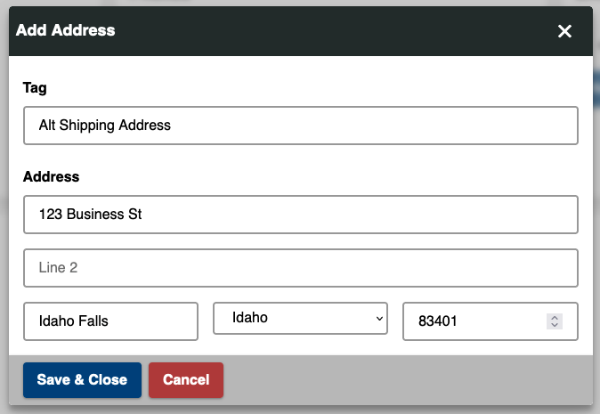

# Company Management

Welcome to the FRM Admin Portal Company Management Docs! All of the processes listed in this documentation begin by selecting the "Companies" tab on the left-hand side of the admin portal home page.

Once the companies tab is selected, you will be redirected to the companies page, which shows a list of all registered companies and their statuses.

## Add Company

A company can be added to the database by clicking the green "Add Company" button at the top of the page.

Fill out the requested information in the form and click the blue "Add" button. To stop the process of creating a company, click "Cancel".

## Edit Company

To Edit a company, select the company you wish to edit from the list. This will bring you to the Company Details Page.

Clicking the blue "Edit" button at the top of the page will bring up a form similar to the create a new company form. Change the information filled in the form, and click "Save & Close"

You can also click on any one of the blue "Add \_\_\_" buttons in each of the sections.

When you click on these buttons, a form will appear that will ask for a tag and whatever information you are needing to enter. The tag can be anything to describe the new information: home phone, personal address, backup email, etc. Then enter the new information.

When you add new information, it will automatically be added to the company details page.

:::note

If you do not see the new information, try refreshing the page

:::

## Review Company

## Delete Company

## Add Company User
