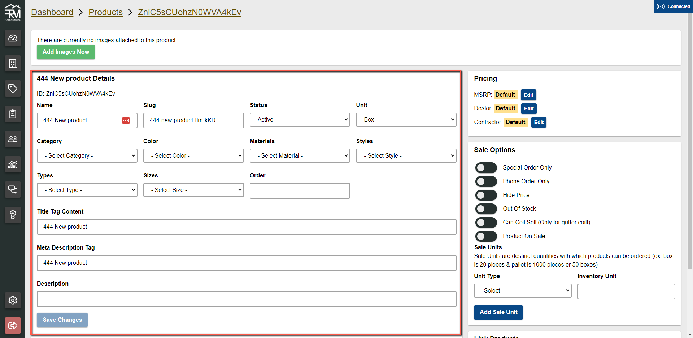
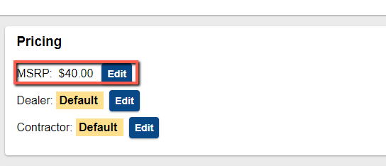
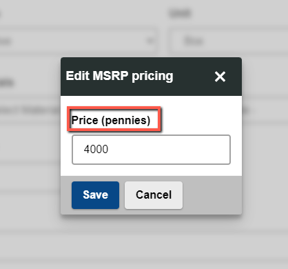
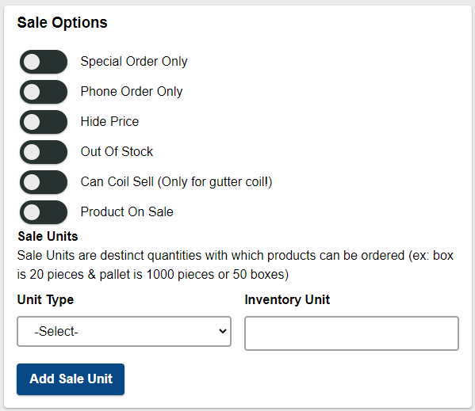
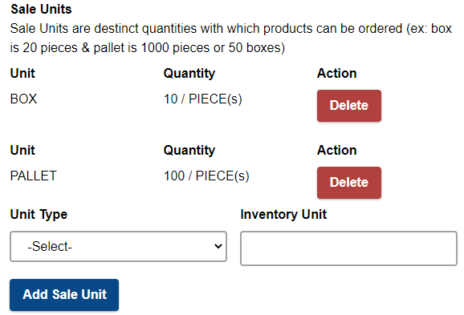

# Products

Products are individual items that are sold. There is a lot of meta data that goes into products and many ways they can be customized.

Figure 1 - Common links and actions to interact with products

## Add Product

To manually add a product to the system start by clicking the **Add Product** button (#4 from the Figure 1)

Follow the on screen instructions to create the product.

## Add Products Bulk (.csv)

Adding products in Bulk is a quick way to efficiently add a large or small number of products to the system all at once. It comes with a few caveats but mostly streamlines the process of adding products.

1. Download the `.csv` template from the admin portal products page
   
2. Open the spreadsheet program of your choice and add products as you desire following the [Spreadsheet Manipulation Rules](./spreadsheet-manipulation-rules)
   
3. Save the file and upload it with the changes
   
   

## Manage Product Images

Easily remove and add product images.

1. Navigate to the product details page of the product you wish to manage
2. Hover the images to see a delete button with a garbage can. Press this button to delete the image.
   
3. Press `Add Images` button to be guided through uploading images to the product
   

## Update Product Details

You have complete freedom to update information about a product on the product page. Each field has a purpose we will go ahead and outline those here.

| Field                | Description                                                                           | Required |
| -------------------- | ------------------------------------------------------------------------------------- | -------- |
| Name                 | Display name of the product used universally on the website and app                   | yes      |
| Slug                 | The segmant of the web address that uniquely identifies this product (must be unique) | yes      |
| Status               | Dictates weather the product is visible or hidden to customers using app or website   | yes      |
| Category             | The immediate category that this product is related to                                | no       |
| Color                | Color value                                                                           | no       |
| Material             | Material value                                                                        | no       |
| Style                | Style value (Style D, Style K, etc...)                                                | no       |
| Type                 | Type value                                                                            | no       |
| Size                 | Size value                                                                            | no       |
| Order                | Order priority of this item in the user interface                                     | no       |
| Title Tag            | SEO                                                                                   | yes      |
| Meta Description Tag | SEO                                                                                   | yes      |
| Description          | Displayed on the product page to give additional information to customers             | no       |

## Update Product Pricing

Product pricing is managed by pricing tiers. Each company customer is assigned a pricing tier (default MSRP). Pricing tiers can be edited and adjusted on the product page.

:::info
When editing a pricing tier always enter the value in pennies
:::

By default all pricing tiers will rely off of the **MSRP** Pricing tier so always ensure this value is populated on active products.

## Manage Product Sale Options

Product sale options can be turned on and off on a per product basis. Each switch controls how the product is shown to the user ina unique way.

1. **Special Order Only** - Lets the customer know this item is special order and will require additional planning to be fulfilled.
2. **Phone Order Only** - **DO NOT USE** will soon be deleted in favor of **Special Order Only**
3. **Hide Price** - Removes all indication of pricing on the product and does not allow customers to purchase it. Intended to be used with **Special Order Only** and Copper products.
4. **Out Of Stock** - Lets the customer know this item is out of stock **(The customer can still order the product)**.
5. **Can Coil Sell** - As is shown in the interface this switch alters how this product can be purchased. Only used for gutter coil.
6. **Product On Sale** - This switch lets the customer know that this product is on sale.

### Product Sale Units

Sale units are additional quantities that we use to sell to the customer. For example drip edge can be purchased by the piece, box, or pallet. All sale unit values are based off of the base unit.

## Update Products Bulk (.csv)

## Update Products Bulk (AP)

## Link Products

## Product Options
