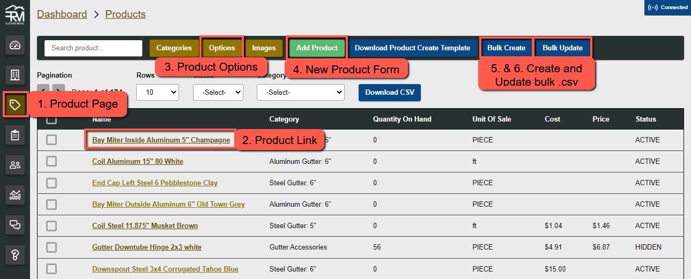
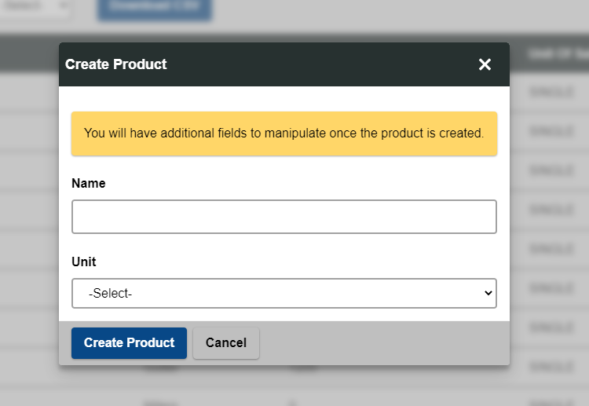
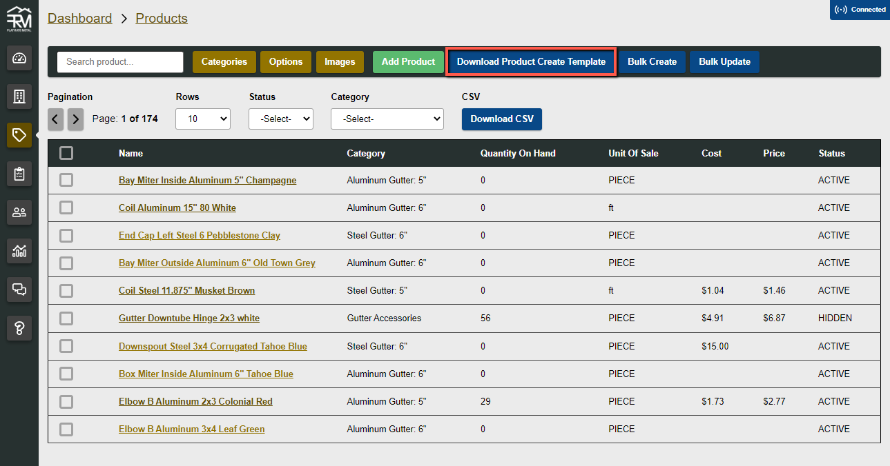
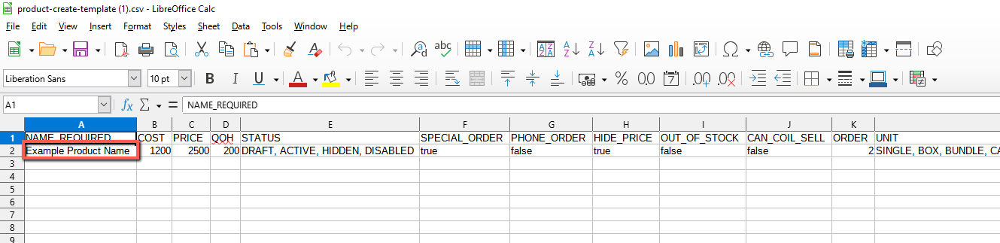
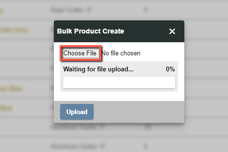
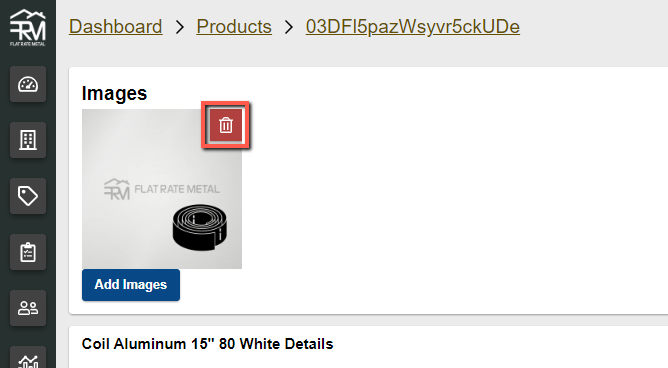
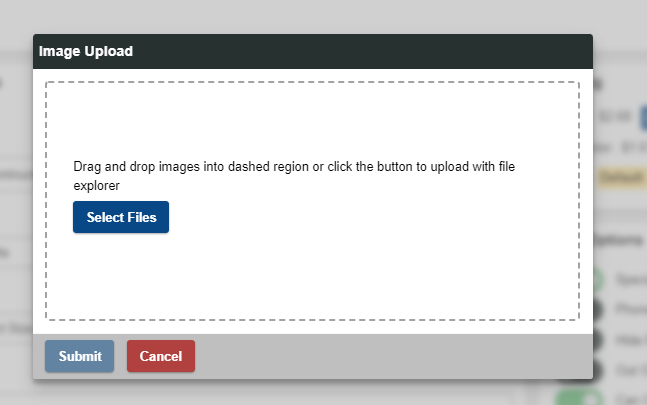

# Products

Products are individual items that are sold. There is a lot of meta data that goes into products and many ways they can be customized.

Figure 1 - Common links and actions to interact with products

## Add Product

:::caution

This feature is overdue for an upgrade and is planned to be updated to be more intuitive. Consider using [Add Products Bulk (.csv)](#add-products-bulk-csv) instead.

:::

To manually add a product to the system start by clicking the **Add Product** button (#4 from the Figure 1)

Follow the on screen instructions to create the product.

## Add Products Bulk (.csv)

Adding products in Bulk is a quick way to efficiently add a large or small number of products to the system all at once. It comes with a few caveats but mostly streamlines the process of adding products.

1. Download the `.csv` template from the admin portal products page
   
2. Open the spreadsheet program of your choice and add products as you desire following the [Spreadsheet Manipulation Rules](./spreadsheet-manipulation-rules)
   
3. Save the file and upload it with the changes
   
   

## Manage Product Images

Easily remove and add product images.

1. Navigate to the product details page of the product you wish to manage
2. Hover the images to see a delete button with a garbage can. Press this button to delete the image.
   
3. Press `Add Images` button to be guided through uploading images to the product
   

## Update Product Details

## Update Product Pricing

## Manage Product Sale Options

### Product Sale Units

## Update Products Bulk (.csv)

## Update Products Bulk (AP)

## Link Products

## Product Options
