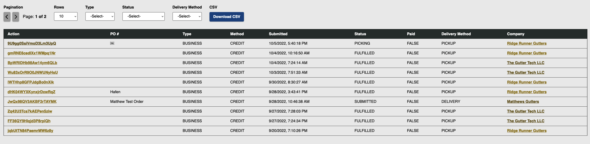
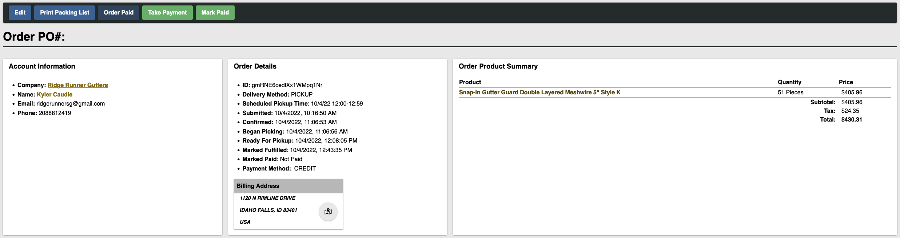
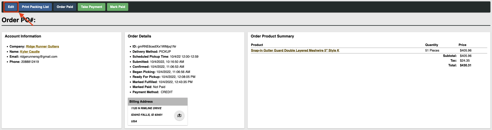

# Orders

Welcome to the FRM Admin Portal Order Management Docs! All of the processes listed in this documentation begin by selecting the "Orders" tab on the left-hand side of the admin portal home page.

## Order List

## Order Details Page

## Order Process

:::info

Be careful with the following actions, as updating a customer's order either with products or status will send a notification to that customer. Do not move an order on to the next stage unless you are certain.

:::

### Edit Order

### Confirm Order

When you have received an order and have made sure that all the ordered items are in stock, then you may select "Confirm Order". This will bring up a window where you must confirm that all items are in stock. You can click confirm to send a notification to the customer that their order has been confirmed, and is ready to start picking.

### Picking

When you are ready to begin picking an order, click on the "Start Picking" button. This will set the status of the order to "Picking".

### Packing List

In order to print the packing list, simply click on the "Print Packing List" button. This will bring up the print dialogue for the browser you are using where you can configure settings and which printer to print to. 99% of the time, you will not need to do anything here besides click "Print".

### Ready for Pickup

When you have finished picking the order and it is ready to be picked up, click the "Ready for Pickup" button. This will set the status of the order to "Ready for Pickup" and send a notification to the customer that their order is ready.

### Take Payment

The take payment will charge the customers account or card for the amount of the specific order. Up to this point the payment has only been captured. Clicking the "Take Payment" button will finalize the transaction.

### Order Fulfilled

Once the customer has paid and received their order, click on the "Order Fulfilled" button to set the status of the order to "Fulfilled". This will clear the order from the dashboard, and mark it as complete.

### Receipts
